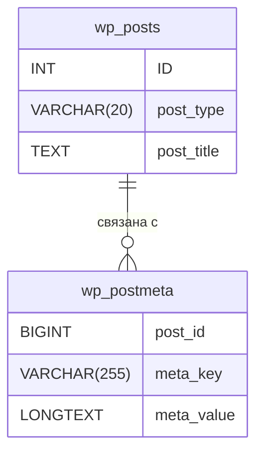

## Структура таблиц

### Таблица `wp_posts`

| Поле             | Тип данных   | Описание                 |
|------------------|--------------|---------------------------|
| `ID`             | INT          | Уникальный идентификатор  |
| `post_author`    | BIGINT       | Автор поста              |
| `post_date`      | DATETIME     | Дата публикации          |
| `post_content`   | LONGTEXT     | Содержимое поста         |
| `post_title`     | TEXT         | Заголовок поста          |
| `post_excerpt`   | TEXT         | Краткое содержание       |
| `post_status`    | VARCHAR(20)  | Статус поста             |
| `comment_status` | VARCHAR(20)  | Статус комментариев      |
| `ping_status`    | VARCHAR(20)  | Статус пингов            |
| `post_password`  | VARCHAR(255) | Пароль для доступа       |
| `post_name`      | VARCHAR(200) | ЧПУ (человекопонятный URL)|
| `to_ping`        | TEXT         | Список ссылок для пинга   |
| `pinged`         | TEXT         | Полученные пинги         |
| `post_modified`  | DATETIME     | Дата последнего изменения|
| `post_modified_gmt` | DATETIME  | Время последнего изменения (GMT) |
| `post_content_filtered` | LONGTEXT | Отфильтрованное содержимое   |
| `post_parent`    | BIGINT       | Родительский пост        |
| `guid`           | VARCHAR(255) | Глобально уникальный идентификатор |
| `menu_order`     | INT          | Порядок сортировки       |
| `post_type`      | VARCHAR(20)  | Тип поста               |
| `post_mime_type` | VARCHAR(100) | MIME-тип вложения        |
| `comment_count`  | BIGINT       | Количество комментариев  |

### Таблица `wp_postmeta`

| Поле       | Тип данных | Описание                |
|------------|------------|--------------------------|
| `meta_id`  | BIGINT     | Уникальный идентификатор |
| `post_id`  | BIGINT     | Идентификатор поста      |
| `meta_key` | VARCHAR(255) | Ключ метаданных         |
| `meta_value` | LONGTEXT | Значение метаданных     |

## Связь между таблицами

Таблицы `wp_posts` и `wp_postmeta` связаны через поле `post_id` в таблице `wp_postmeta`, которое соответствует полю `ID` в таблице `wp_posts`. Эта связь позволяет хранить произвольные метаданные для каждого поста в отдельной таблице.




```mysql
/*
The query selects ID, date, type, title, metadata key, and metadata value of posts with types 'event' and 'program' sorted by ID.
Запрос выбирает идентификатор, дату, тип, заголовок, ключ метаданных и значение метаданных постов с типами 'event' и 'program', отсортированных по идентификатору.
*/

SELECT p.ID, p.post_date, p.post_type, p.post_title, pm.meta_key, pm.meta_value
FROM `wp_posts` AS p
JOIN `wp_postmeta` AS pm ON p.ID = pm.post_id
WHERE p.post_type IN ('event', 'program')
ORDER BY p.ID;
```

---

```mysql
/*
The query selects ID, date, type, title, metadata key, and value from posts joined with postmeta based on their IDs.
Запрос выбирает идентификатор, дату, тип, заголовок, ключ метаданных и значение из постов, объединенных с метаданными по их идентификаторам.
*/

SELECT p.ID, p.post_date, p.post_type, p.post_title, pm.meta_key, pm.meta_value
FROM `wp_posts` AS p
JOIN `wp_postmeta` AS pm ON p.ID = pm.post_id
WHERE p.ID = 50;
```

---
The query results contain information about the event with ID 50, including the creation date, post type ("event"), title ("Test Event"), and various metadata such as the date of the event, related programs, and editing data.

Результаты запроса содержат информацию о событии с ID 50, включая дату создания, тип поста ("event"), заголовок ("Test Event") и различные метаданные, такие как дата события, связанные программы и данные о редактировании.

| ID | post_date           | post_type | post_title | meta_key          | meta_value          |
|----|---------------------|-----------|------------|-------------------|---------------------|
| 50 | 2025-01-15 06:24:45 | event     | Test Event | _edit_lock        | 1737108600:1        |
| 50 | 2025-01-15 06:24:45 | event     | Test Event | footnotes         |                     |
| 50 | 2025-01-15 06:24:45 | event     | Test Event | _edit_last        | 1                   |
| 50 | 2025-01-15 06:24:45 | event     | Test Event | event_date        | 2025-01-27 15:00:00 |
| 50 | 2025-01-15 06:24:45 | event     | Test Event | _event_date       | field_6787a20c38e63 |
| 50 | 2025-01-15 06:24:45 | event     | Test Event | related_programs  | a:1:{i:0;s:2:"82";} |
| 50 | 2025-01-15 06:24:45 | event     | Test Event | _related_programs | field_6789f9b0d346c |

---

1. An event with ID 50, created on January 15, 2025, has an edit lock.
2. The same event does not contain a footnote.
3. The last edit of the event was made by a user with ID 1.
4. The date of the event is January 27, 2025 at 15:00.
5. The date meta field of the event.
6. Associated program with ID 82.
7. Meta field of related programs.

---

1. Событие с ID 50, созданное 15 января 2025 года, имеет блокировку редактирования.
2. То же событие не содержит сноски.
3. Последнее редактирование события было выполнено пользователем с ID 1.
4. Дата проведения события – 27 января 2025 года в 15:00.
5. Метаполе даты события.
6. Связанная программа с ID 82.
7. Метаполе связанных программ.