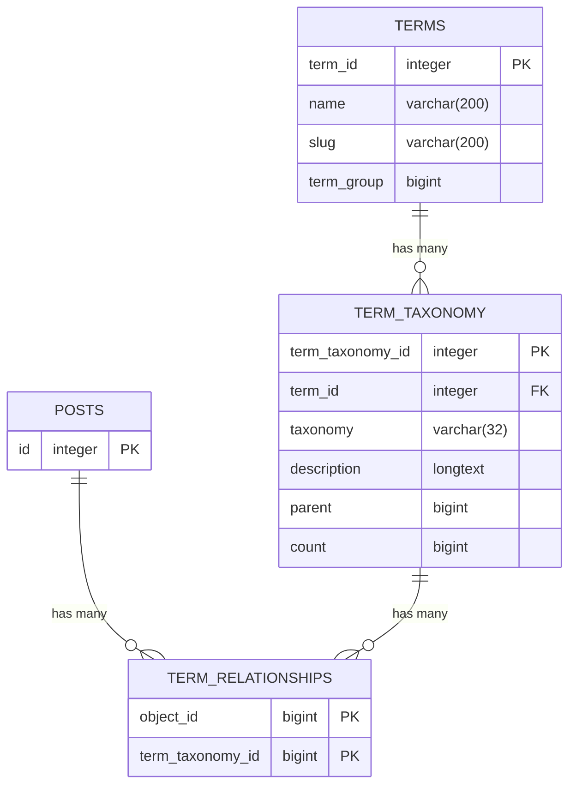

# wp_term_relationships

The `wp_term_relationships` table in WordPress stores the relationships between posts (or other objects like custom post types) and their associated taxonomies (terms). Each row represents an association between a specific post and one or more terms within a given taxonomy. This table helps WordPress manage connections between content and its categorization, making it easier to query and display posts based on their assigned categories, tags, or custom taxonomies.

---

Таблица `wp_term_relationships` в WordPress хранит отношения между записями (или другими объектами, такими как пользовательские типы записей) и их соответствующими таксономиями (терминами). Каждая строка представляет собой связь между конкретной записью и одним или несколькими терминами внутри данной таксономии. Эта таблица помогает WordPress управлять связями между содержимым и его категоризацией, упрощая запросы и отображение записей на основе присвоенных категорий, тегов или пользовательских таксономий.

## Describe wp_term_relationships

| Field            | Type            | Null | Key | Default | Extra |
|------------------|-----------------|------|-----|---------|-------|
| object_id        | bigint unsigned | NO   | PRI | 0       |       |
| term_taxonomy_id | bigint unsigned | NO   | PRI | 0       |       |
| term_order       | int             | NO   |     | 0       |       |

## Example of wp_term_relationships table

| object_id | term_taxonomy_id | term_order |
|-----------|------------------|------------|
|         1 |                1 |          0 |
|        11 |                2 |          0 |
|        15 |                3 |          0 |
|        22 |                3 |          0 |
|        23 |                2 |          0 |
|        24 |                1 |          0 |
|        90 |                2 |          0 |
|        91 |                2 |          0 |
|       103 |                2 |          0 |

