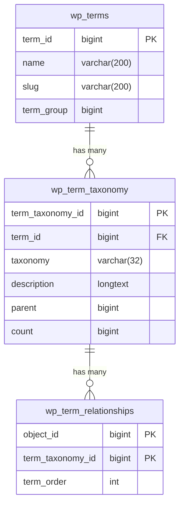

**Taxonomy**

Taxonomy in WordPress refers to the method of categorizing and organizing content on a website. It provides a way to group posts and custom post types together based on their similarities or relationships. The two default taxonomies in WordPress are categories and tags, but developers can also create custom taxonomies for more specific classification needs.

Таксономия в WordPress — это способ классификации и организации контента на сайте. Она позволяет группировать записи и пользовательские типы записей на основе их сходств или взаимосвязей. В WordPress есть две стандартные таксономии: категории и метки, но разработчики могут также создавать собственные таксономии для более специфической классификации.

## Table

The `wp_term_taxonomy` table stores information about terms' taxonomies, including IDs, taxonomy names, descriptions, parents, and term counts.

| Field            | Type            | Null | Key | Default | Extra          |
|------------------|-----------------|------|-----|---------|----------------|
| term_taxonomy_id | bigint unsigned | NO   | PRI | NULL    | auto_increment |
| term_id          | bigint unsigned | NO   | MUL | 0       |                |
| taxonomy         | varchar(32)     | NO   | MUL |         |                |
| description      | longtext        | NO   |     | NULL    |                |
| parent           | bigint unsigned | NO   |     | 0       |                |
| count            | bigint          | NO   |     | 0       |                |

## Example

| term_taxonomy_id | term_id | taxonomy | description | parent | count |
|------------------|---------|----------|-------------|--------|-------|
|                1 |       1 | category |             |      0 |     2 |
|                2 |       2 | nav_menu |             |      0 |     5 |
|                3 |       3 | nav_menu |             |      0 |     2 |
|                5 |       5 | category |             |      0 |     2 |
|                6 |       6 | post_tag |             |      0 |     0 |
|                7 |       7 | post_tag |             |      0 |     0 |
|                8 |       8 | post_tag |             |      0 |     0 |
|                9 |       9 | post_tag |             |      0 |     0 |

## Relationships

