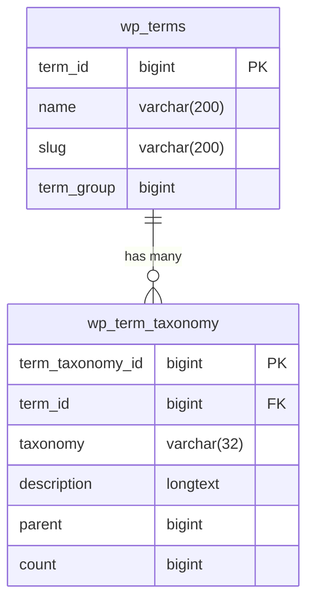

# wp_terms

In WordPress, terms are used to categorize content within taxonomies. For example, categories and tags are types of taxonomies that help organize posts or custom post types. Terms allow users to group related content together, making it easier for visitors to navigate the site and find relevant information.

- The category "Sport" and the tag "Football" are examples of terms. They represent specific elements used to classify content.
- Categories and tags are types of taxonomies. A taxonomy is a structure that allows grouping and classifying content. Therefore, the category "Sport" is a term within the category taxonomy, while the tag "Football" is a term within the tag taxonomy.

В WordPress термины используются для категоризации контента внутри таксономий. Например, категории и метки являются видами таксономий, которые помогают организовывать записи или пользовательские типы записей. Термины позволяют пользователям объединять связанный контент вместе, облегчая посетителям навигацию по сайту и поиск нужной информации.

- Категория "Спорт" и тег "Футбол" – это примеры терминов. Они представляют собой конкретные элементы, используемые для классификации контента.
- Категории и метки – это виды таксономий. Таксономия – это структура, которая позволяет группировать и классифицировать контент. Таким образом, категория «Спорт» является термином внутри таксономии категорий, а тег «Футбол» – термином внутри таксономии меток.

## Table

| Field      | Type            | Null | Key | Default | Extra          |
|------------|-----------------|------|-----|---------|----------------|
| term_id    | bigint unsigned | NO   | PRI | NULL    | auto_increment |
| name       | varchar(200)    | NO   | MUL |         |                |
| slug       | varchar(200)    | NO   | MUL |         |                |
| term_group | bigint          | NO   |     | 0       |                |

## Example 

| term_id | name      | slug      | term_group |
|---------|-----------|-----------|------------|
|       1 | news      | news      |          0 |
|       2 | main      | main      |          0 |
|       3 | footer    | footer    |          0 |
|       5 | test      | test      |          0 |
|       6 | test tag  | test-tag  |          0 |
|       7 | new tag   | new-tag   |          0 |
|       8 | event-tag | event-tag |          0 |
|       9 | news      | news      |          0 |

## Relationships

